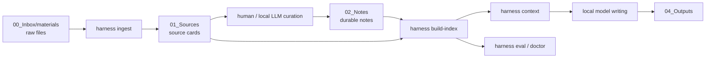

# wikiR Architecture / wikiR 架构

Full bilingual documentation:

- English: `docs/en/architecture.md`
- 中文：`docs/zh/architecture.md`

完整双语文档见：

- English: `docs/en/architecture.md`
- 中文：`docs/zh/architecture.md`

## Minimal Pipeline / 最小流水线

## Why This Shape / 为什么这样设计

- Raw files and source cards are separated, so evidence remains traceable.
- Long-term notes are separated from project drafts, so the wiki stays reusable.
- Retrieval context is generated before writing, so the model works from inspectable evidence.
- Evaluation cases live in the vault, so search quality can be improved over time.
- 原始文件和源卡分离，证据链可追溯。
- 长期笔记和项目草稿分离，wiki 不会被一次性任务污染。
- 写作前先生成检索上下文，模型基于可检查证据工作。
- 评估用例保存在 vault 中，检索质量可以持续回归测试。

## Future Retrieval Layers / 检索层演进

Current retrieval is deterministic BM25-style lexical search with Chinese character n-grams and English tokens. This is the baseline.

Future layers can be added without changing note structure:

1. Local embedding recall over the same chunks.
2. Local reranker for the top 30-100 candidates.
3. Query expansion from the local model, logged into `90_System/logs/`.
4. Task-specific eval sets for proposals, reports, product specs, and research notes.

当前检索是确定性的 BM25 风格词面搜索，支持中文字符 n-gram 和英文 token。这是可解释的基线。

后续可以在不改变笔记结构的情况下加入本地 embedding 召回、本地 reranker、query expansion 和任务型评估集。
