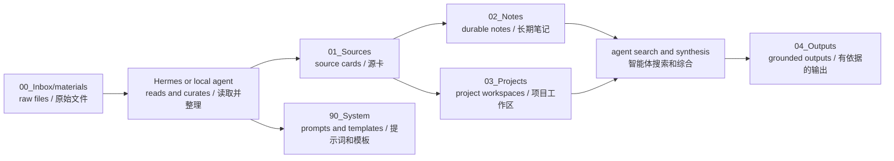

# wikiR Architecture / wikiR 架构

Full bilingual documentation:

- English: `docs/en/architecture.md`
- 中文：`docs/zh/architecture.md`

完整双语文档见：

- English: `docs/en/architecture.md`
- 中文：`docs/zh/architecture.md`

## Minimal Pipeline / 最小流水线

## Design Choice / 设计选择

wikiR is a vault structure and agent operating contract, not a Python harness.

wikiR 是 vault 结构和智能体操作契约，不是 Python harness。

Document parsing, OCR, search, and model inference belong to Hermes or the chosen local runtime.

文档解析、OCR、搜索和模型推理属于 Hermes 或选定的本地运行时职责。
