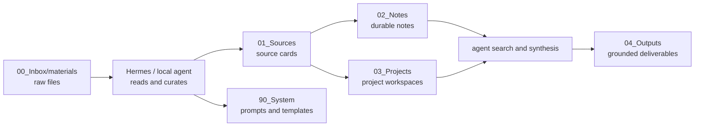

# wikiR Architecture

## Minimal Pipeline

## Design Choice

wikiR is not a Python tooling project. It is a vault structure and operating contract for local agents.

The project keeps durable assets in plain files:

- folder conventions;
- source-card and note templates;
- prompt profiles;
- Obsidian-compatible Markdown;
- human-readable docs.

Document parsing, OCR, semantic search, and model inference are runtime responsibilities. Hermes or another local agent can provide those capabilities in the way that best fits the user's machine and models.

## Why This Shape

- Raw files remain traceable and untouched.
- Source cards make evidence reusable without rewriting original materials.
- Durable notes stay separate from project drafts.
- Runtime-specific tools can evolve without changing the vault format.
- Humans can maintain the vault even when the agent runtime changes.

## Extension Points

Future integrations should be added as optional runtime adapters, plugins, or MCP servers, not as required user-facing commands.

Useful optional integrations include:

1. OCR for scanned PDFs and images.
2. Better Word / PDF extraction through the runtime.
3. Local semantic search over vault files.
4. Link and frontmatter validation.
5. Private-vault backup and sync policies.
