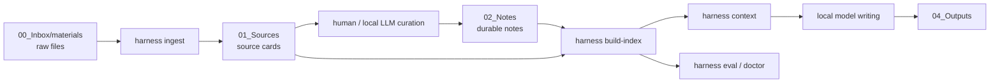

# wikiR Architecture

## Minimal Pipeline

## Why This Shape

- Raw files and source cards are separated, so evidence remains traceable.
- Long-term notes are separated from project drafts, so the wiki stays reusable.
- Retrieval context is generated before writing, so the model works from inspectable evidence.
- Evaluation cases live in the vault, so search quality can be improved over time.

## Future Retrieval Layers

Current retrieval is deterministic BM25-style lexical search with Chinese character n-grams and English tokens. This is the baseline.

Future layers can be added without changing note structure:

1. Local embedding recall over the same chunks.
2. Local reranker for the top 30-100 candidates.
3. Query expansion from the local model, logged into `90_System/logs/`.
4. Task-specific eval sets for proposals, reports, product specs, and research notes.
