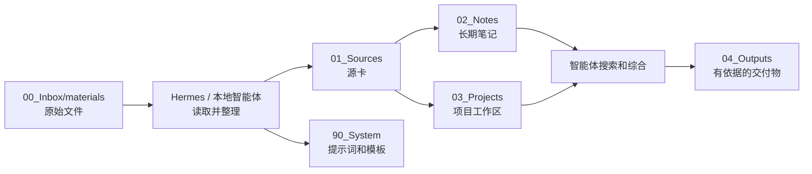

# wikiR 架构

## 最小流水线

## 设计选择

wikiR 不是 Python 工具项目，而是给本地智能体使用的 vault 结构和操作契约。

项目只保留持久、可读、可维护的资产：

- 文件夹约定；
- 源卡和笔记模板；
- 提示词配置；
- Obsidian 兼容 Markdown；
- 人能读懂的文档。

文档解析、OCR、语义搜索、模型推理都属于运行时职责。Hermes 或其他本地智能体可以用最适合用户机器和模型的方式提供这些能力。

## 为什么这样设计

- 原始文件保持可追溯且不被改动。
- 源卡让证据可复用，而不是反复改写原材料。
- 长期笔记和项目草稿分离。
- 运行时工具可以演进，而不改变 vault 格式。
- 即使更换智能体运行时，人也能继续维护 vault。

## 扩展点

未来集成应该以可选 runtime adapter、插件或 MCP server 的形式加入，而不是变成用户必须执行的命令。

有价值的可选集成包括：

1. 扫描 PDF 和图片 OCR。
2. 更好的 Word / PDF 读取能力。
3. 本地语义搜索。
4. 链接和 frontmatter 校验。
5. 私有 vault 备份与同步策略。
