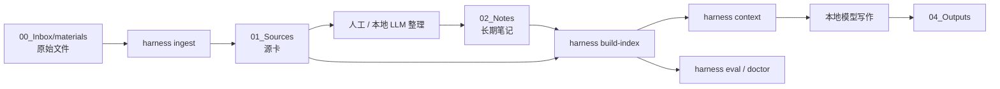

# wikiR 架构

## 最小流水线

## 为什么这样设计

- 原始文件和源卡分离，证据链可追溯。
- 长期笔记和项目草稿分离，wiki 不会被一次性任务污染。
- 写作前先生成检索上下文，模型基于可检查证据工作。
- 评估用例保存在 vault 中，检索质量可以持续回归测试。

## 检索层演进

当前检索是确定性的 BM25 风格词面搜索，支持中文字符 n-gram 和英文 token。这是可解释的基线。

后续可以在不改变笔记结构的情况下加入：

1. 本地 embedding 召回。
2. 本地 reranker，对前 30-100 个候选片段二次排序。
3. 由本地模型做 query expansion，并记录到 `90_System/logs/`。
4. 面向申报书、报告、产品文档、研究笔记的任务型评估集。
